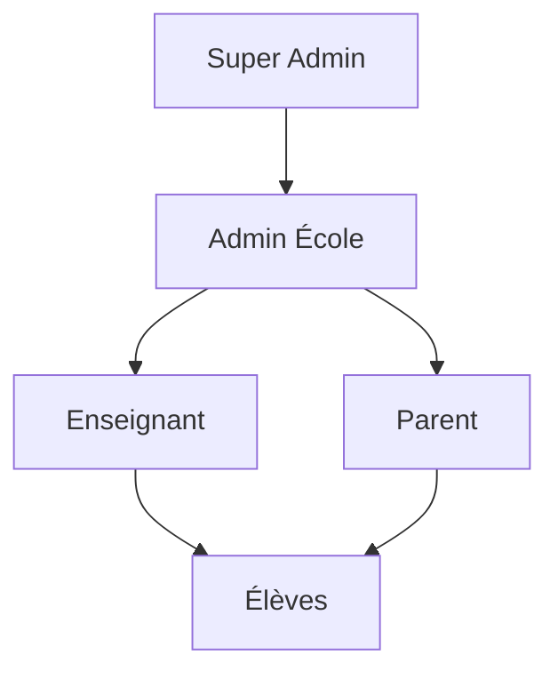

# Architecture et Démarche - Petit Génie

## 📋 Vue d'ensemble

**Petit Génie** est une application éducative construite avec **Next.js 14** et **Supabase**, conçue pour gérer un écosystème éducatif complet avec une hiérarchie de rôles et une sécurité granulaire.

## 🏗️ Architecture Technique

### Stack Technologique
- **Frontend** : Next.js 14 avec TypeScript
- **Backend** : Supabase (PostgreSQL + Auth + RLS)
- **Authentification** : Supabase Auth avec métadonnées personnalisées
- **Base de données** : PostgreSQL avec Row Level Security (RLS)
- **Déploiement** : Vercel (recommandé)

### Structure du Projet
```
src/
├── app/                    # App Router Next.js 14
│   ├── admin/             # Interface administrateur
│   ├── super-admin/       # Interface super administrateur
│   ├── teacher/           # Interface enseignant
│   ├── parent/            # Interface parent
│   ├── auth/              # Pages d'authentification
│   └── api/               # API Routes
├── components/            # Composants React réutilisables
├── lib/                   # Utilitaires et services
│   ├── auth.ts           # Service d'authentification centralisé
│   └── supabase.ts       # Client Supabase
├── types/                 # Définitions TypeScript
└── hooks/                 # Hooks React personnalisés
```

## 👥 Gestion des Utilisateurs et Rôles

### Hiérarchie des Rôles



#### 1. **Super Admin** (`super_admin`)
- **Permissions** : Accès total à toutes les écoles et fonctionnalités
- **Responsabilités** : 
  - Gestion globale de la plateforme
  - Création et supervision des écoles
  - Gestion des administrateurs d'école
- **Création** : Via clé secrète (`SUPER_ADMIN_SECRET_KEY`)

#### 2. **Admin École** (`admin`)
- **Permissions** : Gestion complète de son école
- **Responsabilités** :
  - Création et gestion des classes
  - Invitation et gestion des enseignants
  - Supervision des activités de l'école
- **Création** : 
  - Soit via code d'invitation d'une école existante
  - Soit création d'une nouvelle école avec données complètes

#### 3. **Enseignant** (`teacher`)
- **Permissions** : Gestion de ses classes assignées
- **Responsabilités** :
  - Création et gestion des quiz
  - Suivi des élèves de ses classes
  - Accès aux statistiques de ses classes
- **Création** : Via code d'invitation de l'école

#### 4. **Parent** (`parent`)
- **Permissions** : Accès aux données de ses enfants uniquement
- **Responsabilités** :
  - Suivi des progrès de ses enfants
  - Configuration des paramètres éducatifs
  - Gestion du contrôle parental (PIN)
- **Création** : Inscription libre avec informations enfant

### Service d'Authentification

Le service d'authentification centralisé (`src/lib/auth.ts`) gère :

```typescript
interface SignUpData {
  email: string;
  password: string;
  role: UserRole;
  school_id?: string;           // ID de l'école
  invitation_code?: string;     // Code d'invitation
  full_name?: string;
  child_name?: string;          // Pour les parents
  class_id?: string;           // Nouvelle approche
  class_level?: string;        // Approche dépréciée
  school_data?: {              // Pour création d'école
    nom_ecole: string;
    code_postal?: string;
    ville?: string;
    adresse?: string;
    telephone?: string;
    email?: string;
  };
  secret_key?: string;         // Pour super admin
}
```

**Fonctionnalités clés** :
- Validation des codes d'invitation
- Création automatique des relations (école-utilisateur, parent-enfant)
- Gestion des métadonnées utilisateur
- Création d'écoles à la volée pour les admins

## 🏫 Gestion des Écoles et Classes

### Structure Hiérarchique

```
École
├── Classes (CP, CE1, CE2, CM1, CM2)
│   ├── Enseignants assignés
│   └── Élèves inscrits
└── Code d'invitation unique
```

### Tables Principales

#### **schools** - Écoles
```sql
CREATE TABLE schools (
    id uuid PRIMARY KEY,
    name text NOT NULL,
    address text,
    postal_code text,
    city text,
    phone text,
    email text,
    invitation_code text UNIQUE,  -- Code pour rejoindre l'école
    created_at timestamp,
    updated_at timestamp
);
```

#### **classes** - Classes
```sql
CREATE TABLE classes (
    id uuid PRIMARY KEY,
    name text NOT NULL,
    class_level text NOT NULL,    -- CP, CE1, CE2, CM1, CM2
    school_id uuid REFERENCES schools(id),
    invitation_code text UNIQUE,  -- Code pour rejoindre la classe
    created_at timestamp,
    updated_at timestamp
);
```

#### **school_users** - Relations École-Utilisateur
```sql
CREATE TABLE school_users (
    id uuid PRIMARY KEY,
    school_id uuid REFERENCES schools(id),
    user_id uuid REFERENCES users(id),
    role text CHECK (role IN ('admin', 'teacher')),
    created_at timestamp
);
```

#### **class_teachers** - Relations Classe-Enseignant
```sql
CREATE TABLE class_teachers (
    id uuid PRIMARY KEY,
    class_id uuid REFERENCES classes(id),
    user_id uuid REFERENCES users(id),
    created_at timestamp,
    UNIQUE(class_id, user_id)
);
```

#### **children** - Élèves
```sql
CREATE TABLE children (
    id uuid PRIMARY KEY,
    full_name text NOT NULL,
    class_id uuid REFERENCES classes(id),
    created_at timestamp,
    updated_at timestamp
);
```

#### **parent_children** - Relations Parent-Enfant
```sql
CREATE TABLE parent_children (
    id uuid PRIMARY KEY,
    parent_id uuid REFERENCES users(id),
    child_id uuid REFERENCES children(id),
    created_at timestamp,
    UNIQUE(parent_id, child_id)
);
```

### Codes d'Invitation

**Principe** : Chaque école possède un code d'invitation unique permettant aux enseignants et admins de la rejoindre.

**Génération** : Code aléatoire de 6 caractères alphanumériques en majuscules
```typescript
invitation_code: Math.random().toString(36).substring(2, 8).toUpperCase()
```

## 🔒 Politiques de Sécurité Supabase

### Row Level Security (RLS)

**Principe fondamental** : Chaque table a RLS activé avec des politiques granulaires par rôle.

### Exemples de Politiques

#### **Écoles** (`schools`)
```sql
-- Super Admin voit toutes les écoles
CREATE POLICY "Super Admin peut voir toutes les écoles"
    ON schools FOR SELECT
    USING (auth.jwt() -> 'user_metadata' ->> 'role' = 'super_admin');

-- Admin voit son école
CREATE POLICY "Admin peut voir son école"
    ON schools FOR SELECT
    USING (
        EXISTS (
            SELECT 1 FROM school_users
            WHERE school_users.school_id = schools.id
            AND school_users.user_id = auth.uid()
            AND school_users.role = 'admin'
        )
    );
```

#### **Classes** (`classes`)
```sql
-- Enseignant voit ses classes
CREATE POLICY "Enseignant peut voir ses classes"
    ON classes FOR SELECT
    USING (
        EXISTS (
            SELECT 1 FROM class_teachers
            WHERE class_teachers.class_id = classes.id
            AND class_teachers.user_id = auth.uid()
        )
    );

-- Parent voit la classe de son enfant
CREATE POLICY "Parent peut voir la classe de son enfant"
    ON classes FOR SELECT
    USING (
        EXISTS (
            SELECT 1 FROM parent_children
            JOIN children ON parent_children.child_id = children.id
            WHERE parent_children.parent_id = auth.uid()
            AND children.class_id = classes.id
        )
    );
```

#### **Enfants** (`children`)
```sql
-- Parent voit uniquement ses enfants
CREATE POLICY "Parent peut voir ses propres enfants"
    ON children FOR SELECT
    USING (
        EXISTS (
            SELECT 1 FROM parent_children
            WHERE parent_children.child_id = children.id
            AND parent_children.parent_id = auth.uid()
        )
    );

-- Enseignant voit les enfants de ses classes
CREATE POLICY "Enseignant peut voir les enfants de ses classes"
    ON children FOR SELECT
    USING (
        EXISTS (
            SELECT 1 FROM class_teachers
            WHERE class_teachers.class_id = children.class_id
            AND class_teachers.user_id = auth.uid()
        )
    );
```

### Avantages de cette Approche

1. **Sécurité par défaut** : Aucune donnée n'est accessible sans politique explicite
2. **Performance** : Filtrage au niveau base de données
3. **Simplicité** : Pas besoin de vérifications côté application
4. **Audit** : Traçabilité des accès dans les logs Supabase

## 🔧 Configuration et Déploiement

### Variables d'Environnement

```env
# Supabase
NEXT_PUBLIC_SUPABASE_URL=your_supabase_url
NEXT_PUBLIC_SUPABASE_ANON_KEY=your_supabase_anon_key
SUPABASE_SERVICE_ROLE_KEY=your_service_role_key

# Super Admin
NEXT_PUBLIC_SUPER_ADMIN_SECRET_KEY=your_secret_key

# OpenAI (pour génération de contenu)
OPENAI_API_KEY=your_openai_key
```

### Configuration Supabase

#### 1. **Authentification**
```toml
[auth]
enable_signup = true
enable_confirmations = false  # Simplifié pour le développement
jwt_expiry = 3600
```

#### 2. **Politiques RLS**
- Activées sur toutes les tables sensibles
- Politiques granulaires par rôle
- Utilisation de `auth.uid()` et `auth.jwt()`

#### 3. **Triggers**
```sql
-- Mise à jour automatique des timestamps
CREATE OR REPLACE FUNCTION handle_updated_at()
RETURNS trigger AS $$
BEGIN
    NEW.updated_at = now();
    RETURN NEW;
END;
$$ LANGUAGE plpgsql;
```

### Migrations

Les migrations sont organisées chronologiquement :

1. **01_initial_schema.sql** : Schéma de base avec RLS
2. **02_role_permissions_update.sql** : Architecture hiérarchique complète
3. **03_classes_table.sql** : Gestion avancée des classes
4. **04_rename_level_to_class_level.sql** : Migration des noms de colonnes
5. **20_create_quiz_tables.sql** : Tables pour les quiz

## 🚀 Démarche de Développement Recommandée

### Phase 1 : Configuration de Base
1. **Setup Supabase** : Créer le projet et configurer l'authentification
2. **Migrations** : Exécuter les migrations dans l'ordre
3. **Variables d'environnement** : Configurer les clés API
4. **Premier utilisateur** : Créer un super admin

### Phase 2 : Gestion des Écoles
1. **Interface super admin** : Création et gestion des écoles
2. **Codes d'invitation** : Système d'invitation pour les utilisateurs
3. **Validation** : Tests des politiques RLS

### Phase 3 : Gestion des Classes
1. **Interface admin** : Création et gestion des classes
2. **Attribution enseignants** : Système d'assignation
3. **Inscription élèves** : Processus d'inscription des enfants

### Phase 4 : Interfaces Utilisateur
1. **Dashboard par rôle** : Interfaces spécialisées
2. **Permissions** : Validation des accès
3. **UX/UI** : Optimisation de l'expérience utilisateur

## 📊 Bonnes Pratiques

### Sécurité
- ✅ RLS activé sur toutes les tables sensibles
- ✅ Politiques granulaires par rôle
- ✅ Validation côté serveur ET client
- ✅ Codes d'invitation pour contrôler l'accès
- ✅ Métadonnées utilisateur sécurisées

### Performance
- ✅ Index sur les colonnes de jointure
- ✅ Requêtes optimisées avec `select()`
- ✅ Pagination pour les grandes listes
- ✅ Cache des données utilisateur

### Maintenabilité
- ✅ Types TypeScript stricts
- ✅ Service d'authentification centralisé
- ✅ Composants réutilisables
- ✅ Hooks personnalisés pour la logique métier

## 🔄 Migration et Évolution

### Points d'Attention
- **class_level → class_id** : Migration progressive en cours
- **Middleware** : Temporairement désactivé pour le développement
- **Codes d'invitation** : Génération automatique vs manuelle

### Évolutions Futures
- Système de notifications
- Analytics avancées
- API publique pour intégrations
- Mobile app avec React Native

## 🐛 Debugging et Monitoring

### Logs Importants
- Erreurs d'authentification dans `lib/auth.ts`
- Violations RLS dans les logs Supabase
- Erreurs de middleware (quand activé)

### Outils de Debug
- Supabase Dashboard pour les logs SQL
- Next.js DevTools pour les requêtes
- Console browser pour les erreurs client

---

Cette architecture offre une base solide pour une application éducative multi-tenant avec une sécurité robuste et une scalabilité éprouvée.
